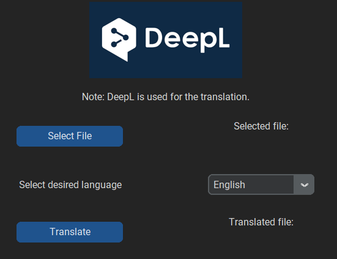

# PDF Translator
A really simple application that extracts text from a **pdf file** and **translates** it. It was more of a learning project because the functionality is really **limited**. Far better pdf file translation can be achieved by using the **online DeepL file translator feature**.

For the translation process DeepL API is used. GUI was made with Tkinter and CustomTkinter.

## Usage
- User selects a pdf file.
- User selects a language into which the text is to be translated.
- New pdf file will be created in the same directory as the original with addition of "_copy" in the file name.

## Important notes
- For program functionality you need to insert your own **DeepL API key** to "key.env" file in the "res" directory.
- The program only takes the text from the pdf and only the text is translated and shown in the new file. This  means that all of the **file formatting, images, etc. will not appear** in the translated version.
- Free DeepL API offers a translation of 500k characters/month.
